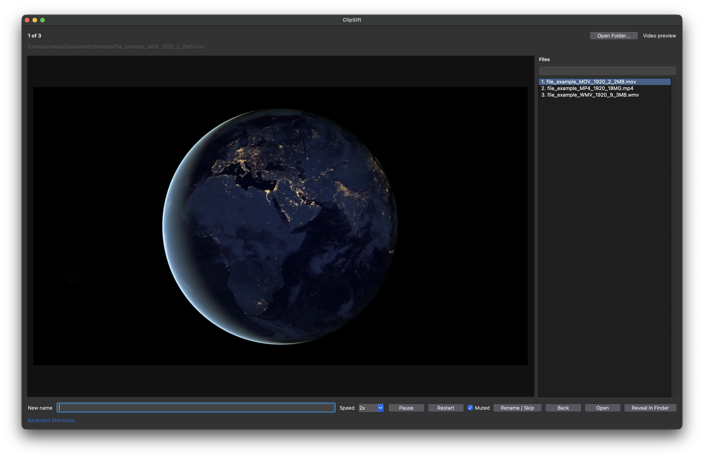

<p align="center">
  
</p>

# ClipSift — review and rename photos & videos on macOS

Turn a folder of camera filenames into a collection you can recognize. Preview each photo or video, give it a useful name, and press Enter to move on. ClipSift is a desktop app for photographers, video creators, and anyone organizing personal media.

**[Download ClipSift 1.0.0 for macOS](https://github.com/arseelali/ClipSift/releases/download/v1.0.0/ClipSift-1.0.0-macOS.dmg)** · [Latest release & notes](https://github.com/arseelali/ClipSift/releases/latest) · [Website](https://arseelali.github.io/ClipSift/web/) · [Report a problem](https://github.com/arseelali/ClipSift/issues/new?template=bug_report.md)



## Why use ClipSift?

- **Review faster:** play video previews at 1×, 2×, 4×, or 8×, with pause, mute, and fullscreen controls.
- **Name files as you review:** type only the new name; ClipSift keeps the extension and advances to the next file. Leave the box blank to skip.
- **Stay in one window:** preview media, search the file list, open a file in its default app, or reveal it in Finder.
- **Keep your place:** resume from the last folder and file, recall your previous filename input, and undo renames during the session.
- **Work locally:** media is processed on your Mac without an upload or account workflow. Settings and session state are saved in `~/.ClipSift.json`.

Use it to label clips before an edit, review a camera shoot, or organize a folder of family photos and travel videos. For example, rename `IMG_2048.JPG` to `lake-at-sunset.JPG` while keeping the original image contents.

## Install on macOS

1. [Download the DMG](https://github.com/arseelali/ClipSift/releases/download/v1.0.0/ClipSift-1.0.0-macOS.dmg), or find it under **Assets** on the [latest release](https://github.com/arseelali/ClipSift/releases/latest).
2. Open the DMG and drag **ClipSift.app** into **Applications**.
3. Launch ClipSift from Applications, then choose **Open Folder…**.

The downloadable package is for macOS. Windows and Linux installers are not currently provided. If macOS blocks first launch, review [Apple’s guidance for safely opening downloaded apps](https://support.apple.com/102445).

## Try your first folder

1. Choose a small folder of photos or videos. Rename changes the actual filenames, so use a copy of the folder for your first try.
2. Preview the current file and type a descriptive name without its extension.
3. Press **Enter** to rename and advance. Press **Enter** with an empty field to skip without renaming.
4. Use **Command-Z** to undo the last rename during the current session.

ClipSift renames files in place; it does not edit their media contents. Skipping does not delete a file. If a name already exists, the app offers an available alternative instead of silently replacing it.

## Supported Media

Photos:

```text
.jpg .jpeg .png .gif .bmp .tif .tiff .heic .heif .webp .raw .cr2 .nef .arw .dng
```

Videos:

```text
.mp4 .mov .m4v .avi .mkv .webm .wmv .flv .mpeg .mpg .3gp .mts .m2ts
```

Preview availability depends on the file format and the decoders available on your Mac. Recognizing an extension does not guarantee that every codec or RAW file can be previewed. Use **Command-O** to open the current file in its default app when an in-app preview is unavailable.

## Common Shortcuts

| Shortcut | Action |
| --- | --- |
| `Enter` | Rename or skip |
| `Command-O` | Open current media |
| `Command-A` | Previous file |
| `Command-D` | Next file |
| `Command-S` | Use current filename in the rename box |
| `Command-F` | Fullscreen media |
| `Command-Shift-F` | Focus the search box |
| `Command-R` | Focus the rename box |
| `Command-P` | Play or pause video preview |
| `Command-M` | Toggle mute |
| `Command-Z` | Undo rename |
| `Up` | Recall previous nonblank filename input |

Shortcuts can be customized from the app menu.

## Troubleshooting

- **Video preview is unavailable:** video playback needs `ffmpeg`; audio needs `ffplay`. For a downloaded app, [report the problem](https://github.com/arseelali/ClipSift/issues/new?template=bug_report.md) with the app version, macOS version, Mac chip, and file type. For a source build, see [BUILD.md](BUILD.md) for bundling these tools.
- **A file is missing from the list:** ClipSift lists recognized media files directly inside the selected folder. Hidden files and macOS `._` metadata files are ignored. To include nested folders, enable **Include Subfolders** in the File menu or Settings.
- **A rename fails:** check the folder’s write permissions and whether another app has moved or renamed the file.

## Run from source

For developers, use Python 3.10 or later with Tkinter, plus `ffmpeg` for video previews and optional `ffplay` for audio. The packaged app is the easiest starting point for macOS users.

```bash
git clone https://github.com/arseelali/ClipSift.git
cd ClipSift
python3 ClipSift.py
```

See [BUILD.md](BUILD.md) to build a macOS app or DMG.

## Help improve ClipSift

[Report a bug](https://github.com/arseelali/ClipSift/issues/new?template=bug_report.md) or [suggest a feature](https://github.com/arseelali/ClipSift/issues/new?template=feature_request.md). Tell us what you were trying to organize and what would make that workflow easier. Use sample media and remove personal paths from screenshots or logs.

If ClipSift is useful to you, star the repository to find it again, share it with someone who reviews media folders, or watch **Releases** on GitHub for updates.
